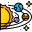

# 🚀 3D Solar System Explorer



An interactive 3D visualization of our Solar System built with Three.js. Explore the planets, their orbits, and witness realistic astronomical mechanics in your browser!

## ✨ Features

- **🌍 Realistic 3D Planets**: All planets with accurate textures and relative sizes
- **🪐 Planetary Rings**: Saturn and Uranus with detailed ring systems  
- **🌌 Space Environment**: Beautiful starfield background for immersive experience
- **🎮 Interactive Controls**: Mouse controls to explore and navigate around the solar system
- **⚡ Speed Control**: Adjust animation speed from slow motion to time-lapse
- **🛸 Orbital Paths**: Toggle visibility of planetary orbital paths
- **💡 Realistic Lighting**: Toggle between realistic space lighting and enhanced visibility
- **📱 Responsive**: Works on desktop and mobile browsers

## 🎯 How to Use

1. **Navigation**: Use your mouse to rotate, zoom, and pan around the solar system
   - Left click + drag: Rotate view
   - Scroll wheel: Zoom in/out
   - Right click + drag: Pan view

2. **Controls Panel**: Use the control panel (top-right) to:
   - **Speed**: Adjust animation speed (0-20x)
   - **Show path**: Toggle orbital path visibility
   - **Real view**: Toggle realistic lighting (planets dark on non-sun side)

3. **Exploration**: 
   - Observe planetary rotations and orbital movements
   - Notice the different orbital speeds (Mercury moves fastest, Neptune slowest)
   - Examine the rings of Saturn and Uranus
   - Experience the scale of our solar system

## 🌟 Educational Value

This visualization demonstrates:
- **Orbital Mechanics**: How planets orbit the Sun at different speeds
- **Planetary Scale**: Relative sizes of planets (though not to true scale for visibility)
- **Rotation Periods**: Different planetary rotation speeds
- **Solar System Structure**: Spatial arrangement of planets
- **Astronomical Phenomena**: Rings, lighting effects, and celestial movements

## 🚀 Quick Start

Simply open `index.html` in a modern web browser - no installation required!

```bash
# Clone this repository
git clone <repository-url>
cd ffffffff

# Open in browser
open index.html
# or
python -m http.server 8000  # Then visit http://localhost:8000
```

## 🛠️ Technical Details

- **Framework**: Three.js WebGL library
- **Language**: JavaScript (ES6 modules)
- **Dependencies**: dat.GUI for controls
- **Textures**: High-quality planet surface textures
- **Performance**: Optimized for smooth 60fps animation

## 📁 Project Structure

```
ffffffff/
├── index.html              # Main HTML file
├── js/
│   └── solarSystem.js      # Main application logic
├── images/                 # Planet textures and assets
│   ├── sun.jpg
│   ├── mercury.jpg
│   ├── venus.jpg
│   ├── earth.jpg
│   ├── mars.jpg
│   ├── jupiter.jpg
│   ├── saturn.jpg
│   ├── uranus.jpg
│   ├── neptune.jpg
│   ├── pluto.jpg
│   ├── saturn_ring.png
│   ├── uranus_ring.png
│   ├── stars.jpg
│   └── solar-system.png
└── README.md
```

## 🌍 Browser Compatibility

- ✅ Chrome 60+
- ✅ Firefox 55+
- ✅ Safari 12+
- ✅ Edge 79+
- 📱 Mobile browsers (iOS Safari, Chrome Mobile)

## 🎓 Educational Applications

Perfect for:
- **Schools**: Astronomy and physics education
- **Museums**: Interactive space exhibits
- **Science Centers**: Public demonstrations
- **Personal Learning**: Exploring our solar system
- **Presentations**: Engaging astronomy talks

## 🤝 Contributing

This project is based on the excellent work from [ankitjha2603/solar-system3D](https://github.com/ankitjha2603/solar-system3D). 

Feel free to contribute by:
- Adding more celestial bodies (moons, asteroids)
- Improving textures and visual effects
- Adding educational information panels
- Enhancing mobile experience
- Adding sound effects

## 📜 License

This project uses resources and code adapted from open source projects. Please respect the original creators' work and licenses.

## 🙏 Credits

- Original Three.js Solar System implementation: [ankitjha2603](https://github.com/ankitjha2603)
- Three.js: The amazing 3D library that makes this possible
- Planet textures: NASA and various space agencies
- dat.GUI: Control interface library

---

**Enjoy exploring our amazing Solar System! 🌟**